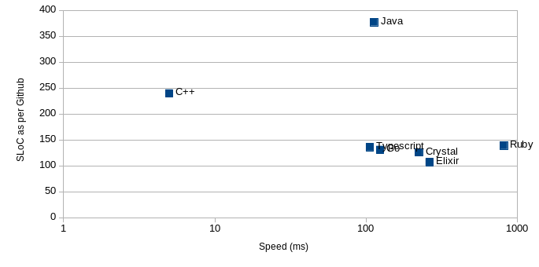

# hamiltonian_comp

## Introduction
Much of what Trapeze does is around solving various versions of the travelling
salesman problem. Finding a [Hamiltonian path](https://en.wikipedia.org/wiki/Hamiltonian_path)
is a related but simpler problem.  The aim is to find a path in an undirected
graph that visits all nodes exactly once.

A few years back I ran a small programming competition at a conference of our
senior developers.  The goal was to find a Hamiltonian path for the eastern
states of the USA.  I gave them a partial implementation in Ruby and they were
then required to fill out the blanks.  None of the attendees had written Ruby
before.

More recently, we have started looking at implementing more modern versions of
our key algorithms.  Before embarking on this, I wanted to explore the suitability
of some of the more modern languages.  This repository captures our investigation.
This is not the most scientific language comparison, but nonetheless it is interesting.

Each implementation allowed us to explore the strengths and weaknesses of the
language both in terms of expressive power, but also execution speed.

I have tried to structure the different implementions in roughly the same way.
That is the actual algorithm is in its own file.  This has not been universally
applied.  For Go, C++ and Elixir all the code is in one file.

I was particularly interested in comparing expressiveness of code against
execution speed.  Lines of code is an indirect measure of that.
The lines of code is measured by adding the SLoCs of all
files required to build and execute the code.  SLoCs was measured by Github.
Execution speed has been measured on Fedora Linux running on a fairly old i5.

And here are the results:



What surprises me is that the difference in measured SLOCs is not more
significant between Ruby, Crystal, Elixir and Go.  My guess is that the single
line of code in Ruby is more expressive than Go, but ultimately, both need
a single line of code to achieve the same result.  See below for more details.

The other thing that surprised me is that Java and Go are not that much faster than
Crystal and Elixir.

## Ruby - the original implementation
Ruby is my personal goto language when I want to explore a concept and implement
something quickly.  It combines a well thought through (although admittedly
slightly quirky) syntax with a very powerful object library.  As a result
you can write in a single line what in other languages such as Java would
probably be many lines of code.

Ruby is interpreted.  Part of Ruby's power comes from the fact that it is a
strongly typed, but dynamically type checked language.  The downside to this
approach is that the language is slow.  In this benchmark its four times slower
than Crystal and Elixir, and five times slower than Java.  Also, to make the language
thread-safe, the Ruby standard interpreter has the global interpreter lock
which ensures only one thread executes at a time, even when running on a
multi-core machine.

The implementation can be found in the [ruby](ruby/hamiltonian.rb) directory.
When I originally constructed the problem I actually created a neighbour's graph
for the whole mainland USA (excluding Alaska and Hawaii).  However, it took too
long to run, so I wrote some code to reduce the graph to the Eastern half.
I have left it in, as it helps explore a language and its ability to manipulate
hash maps and lists.

```console
$ time ruby hamiltonian.rb
user     system      total        real
find hamiltonian[:wdc, :md, :wv, :ky, :tn, :va, :nc, :sc, :ga, :fl, :al, :ms, :la, :ar, :mo, :ia, :mn, :wi, :il, :in, :mi, :oh, :pa, :de, :nj, :ny, :ct, :ri, :ma, :vt, :nh, :me]
0.820000   0.000000   0.820000 (  0.819739)
find hamiltonian[:wdc, :md, :wv, :ky, :tn, :va, :nc, :sc, :ga, :fl, :al, :ms, :la, :ar, :mo, :ia, :mn, :wi, :il, :in, :mi, :oh, :pa, :de, :nj, :ny, :ct, :ri, :ma, :vt, :nh, :me]
0.810000   0.000000   0.810000 (  0.814943)
find hamiltonian[:wdc, :md, :wv, :ky, :tn, :va, :nc, :sc, :ga, :fl, :al, :ms, :la, :ar, :mo, :ia, :mn, :wi, :il, :in, :mi, :oh, :pa, :de, :nj, :ny, :ct, :ri, :ma, :vt, :nh, :me]
0.820000   0.000000   0.820000 (  0.817086)
find hamiltonian[:wdc, :md, :wv, :ky, :tn, :va, :nc, :sc, :ga, :fl, :al, :ms, :la, :ar, :mo, :ia, :mn, :wi, :il, :in, :mi, :oh, :pa, :de, :nj, :ny, :ct, :ri, :ma, :vt, :nh, :me]
0.810000   0.000000   0.810000 (  0.815549)
find hamiltonian[:wdc, :md, :wv, :ky, :tn, :va, :nc, :sc, :ga, :fl, :al, :ms, :la, :ar, :mo, :ia, :mn, :wi, :il, :in, :mi, :oh, :pa, :de, :nj, :ny, :ct, :ri, :ma, :vt, :nh, :me]
0.820000   0.000000   0.820000 (  0.817271)
```

Strengths or Ruby:
- Expressive language
- Pure OO - everything is an object
- Widely used
- Mature
- Good debuggers available

Weaknesses:
- Slow
- Poor support for parallel execution

## Crystal
[Crystal](https://crystal-lang.org/) is a new language inspired by Ruby.  It aims
to provide a syntax that is similar to Ruby without being absolutely compatible.

The main difference to Ruby is that the language is compiled.  It is also statically
typed.  An interesting aspect of the language is that the compiler will reason about
what type a variable can be.  This means that in many instances the compiler is
able to guess the permissible types for a variable without the programmer
needing to spell this out.

The language has inbuilt support for concurrency using the
[Communicating Sequential Processes](https://en.wikipedia.org/wiki/Communicating_sequential_processes) model.
Unfortunately, under the wraps execution is still single threaded.  There is
an experimental branch in the Github repository that has true multi-threaded support.

Because it is a recent language, there is less tool support.  In particular, there
is currently limited debugging available.

```console
# crystal run hamiltonian.cr
Warning: benchmarking without the `--release` flag won't yield useful results
find hamiltonian complete journey = wdc -> md -> wv -> ky -> tn -> va -> nc -> sc -> ga -> fl -> al -> ms -> la -> ar -> mo -> ia -> mn -> wi -> il -> in -> mi -> oh -> pa -> de -> nj -> ny -> ct -> ri -> ma -> vt -> nh -> me
  0.220000   0.000000   0.220000 (  0.226732)
find hamiltonian complete journey = wdc -> md -> wv -> ky -> tn -> va -> nc -> sc -> ga -> fl -> al -> ms -> la -> ar -> mo -> ia -> mn -> wi -> il -> in -> mi -> oh -> pa -> de -> nj -> ny -> ct -> ri -> ma -> vt -> nh -> me
  0.230000   0.000000   0.230000 (  0.224444)
find hamiltonian complete journey = wdc -> md -> wv -> ky -> tn -> va -> nc -> sc -> ga -> fl -> al -> ms -> la -> ar -> mo -> ia -> mn -> wi -> il -> in -> mi -> oh -> pa -> de -> nj -> ny -> ct -> ri -> ma -> vt -> nh -> me
  0.220000   0.000000   0.220000 (  0.224310)
find hamiltonian complete journey = wdc -> md -> wv -> ky -> tn -> va -> nc -> sc -> ga -> fl -> al -> ms -> la -> ar -> mo -> ia -> mn -> wi -> il -> in -> mi -> oh -> pa -> de -> nj -> ny -> ct -> ri -> ma -> vt -> nh -> me
  0.230000   0.000000   0.230000 (  0.225288)
find hamiltonian complete journey = wdc -> md -> wv -> ky -> tn -> va -> nc -> sc -> ga -> fl -> al -> ms -> la -> ar -> mo -> ia -> mn -> wi -> il -> in -> mi -> oh -> pa -> de -> nj -> ny -> ct -> ri -> ma -> vt -> nh -> me
  0.220000   0.000000   0.220000 (  0.224679)
```
This shows the language is pretty fast, but on this problem not as fast as Java.
Note the warning about not using the release flag.  However, when I compile with
the release flag, the compiler dumps out with an LLVM assertion error.

Strengths of Crystal:
- Expressive language
- Pure OO - everything is an object
- Fast

Weaknesses:
- Small community so less support
- Tool chain still in development
- For now, true multi-threaded behaviour is experimental

## Elixir
[Elixir](https://elixir-lang.org/) is a functional programming language based
on Erlang.  Its syntax is rubyesque.  Key features of functional programming
languages are:

* everything is immutable; once a value has been assigned to a variable it
  cannot change
* instead of methods, we have functions; these take a set of inputs and return
  an output  
* instead of if-then-else statements, functional languages rely on pattern
  matching
* instead of loops, functional languages rely on recursion to achieve the same

People are excited about functional languages for two reasons: firstly,
it is easier to reason about whether a program is correct (at least according
to the functional programming disciples), and secondly, because of their structure
it is easier to produce concurrent programs.  This should be a significant advantage
in today's multi-core environment.

While I get all these advantages, as an OO programmer, I find the mental jump
to writing functional programs a big step.  It does not come naturally for me.

The following shows how to pre-compile and then run the code.  
```console
# elixirc hamiltonian.exc

# elixir -e Hamiltonian.run
Solution: [:wdc, :md, :wv, :ky, :tn, :va, :nc, :sc, :ga, :fl, :al, :ms, :la, :ar, :mo, :ia, :mn, :wi, :il, :in, :mi, :oh, :pa, :de, :nj, :ny, :ct, :ri, :ma, :vt, :nh, :me]
{263852, true}
Solution: [:wdc, :md, :wv, :ky, :tn, :va, :nc, :sc, :ga, :fl, :al, :ms, :la, :ar, :mo, :ia, :mn, :wi, :il, :in, :mi, :oh, :pa, :de, :nj, :ny, :ct, :ri, :ma, :vt, :nh, :me]
{268543, true}
Solution: [:wdc, :md, :wv, :ky, :tn, :va, :nc, :sc, :ga, :fl, :al, :ms, :la, :ar, :mo, :ia, :mn, :wi, :il, :in, :mi, :oh, :pa, :de, :nj, :ny, :ct, :ri, :ma, :vt, :nh, :me]
{262652, true}
Solution: [:wdc, :md, :wv, :ky, :tn, :va, :nc, :sc, :ga, :fl, :al, :ms, :la, :ar, :mo, :ia, :mn, :wi, :il, :in, :mi, :oh, :pa, :de, :nj, :ny, :ct, :ri, :ma, :vt, :nh, :me]
{264271, true}
Solution: [:wdc, :md, :wv, :ky, :tn, :va, :nc, :sc, :ga, :fl, :al, :ms, :la, :ar, :mo, :ia, :mn, :wi, :il, :in, :mi, :oh, :pa, :de, :nj, :ny, :ct, :ri, :ma, :vt, :nh, :me]
{263152, true}
```

The number is time for the Hamiltonian search in microseconds.  Now that I have
switched to just measuring the actual Hamiltonian search its much faster than I
expected, and not that far off Crystal.

Strengths or Elixir:
- Elixir/Erlang has a strong runtime environment making deploying large multi-core
  applications easy; this is why the Whatsapp backend is written in Erlang
- Very robust

Weaknesses:
- Functional programming takes getting used to

## Java
Thanks to Neil for implementing this.

Java is one of the two most popular languages around today (the other being C#).
As such it felt important to include it in our evaluation since it is a very
useful reference point.

Compared to Ruby, Java's syntax is not as expressive leading to more lines of
code - although my Java friends tell me that will all change with Java 9.  While
it is fairly OO it does also have primitive types which does sometimes lead to
more complex code.  That said, it is very fast (although it doesn't touch C++),
you will always be able to find an answer to your questions on Stackoverflow,
and there are lots of libraries for it.

```console
# mvn clean package

... lots of output from the build processes

# cd target
# java -jar hamiltonian-path-1.0.0-SNAPSHOT.jar
Java Hamiltonian Path
Found Path
[wdc, md, wv, ky, tn, va, nc, sc, ga, fl, al, ms, la, ar, mo, ia, mn, wi, il, in, mi, oh, pa, de, nj, ny, ct, ri, ma, vt, nh, me]
Run 1 : Duration: 177ms
Found Path
[wdc, md, wv, ky, tn, va, nc, sc, ga, fl, al, ms, la, ar, mo, ia, mn, wi, il, in, mi, oh, pa, de, nj, ny, ct, ri, ma, vt, nh, me]
Run 2 : Duration: 135ms
Found Path
[wdc, md, wv, ky, tn, va, nc, sc, ga, fl, al, ms, la, ar, mo, ia, mn, wi, il, in, mi, oh, pa, de, nj, ny, ct, ri, ma, vt, nh, me]
Run 3 : Duration: 138ms
Found Path
[wdc, md, wv, ky, tn, va, nc, sc, ga, fl, al, ms, la, ar, mo, ia, mn, wi, il, in, mi, oh, pa, de, nj, ny, ct, ri, ma, vt, nh, me]
Run 4 : Duration: 133ms
Found Path
[wdc, md, wv, ky, tn, va, nc, sc, ga, fl, al, ms, la, ar, mo, ia, mn, wi, il, in, mi, oh, pa, de, nj, ny, ct, ri, ma, vt, nh, me]
Run 5 : Duration: 138ms

```

One interesting observation is that because of the way the JIT compiler works
the code gets faster as we repeat it.

Pros:
- maturity
- speed
- availability of 3rd party libraries
- great tool libraries including debuggers
- good concurrency support

Negatives:
- C++-derived syntax can be a bit cumbersome
- not pure OO
- quite restrictive static typing scheme

## Go

If I am honest, I don't know what to think about Go.  Go is really C with some
useful extra language elements added: ranges (a form of dynamic arrays), maps
(same as hashes in Ruby), and direct support for concurrency through
Communicating Sequential Processes.  That is all good.

Bad, IMHO, is that unlike most other modern languages that have replaced pointer
manipulation with references to objects, Go still has the pointer arithmetic as
we know and hated in C.  Go is also not OO, although I see this as less of a
drawback. Go's inbuilt types are not as powerful as the inbuilt types in Elixir
or Ruby.  As a programmer you have to do much more of the lifting yourself.
This almost certainly leads to more efficient programs (in terms of execution
speed), but it also leads to more code.  Here are a few examples:

```ruby
  # Ruby code to print Hello World five times
  5.times { puts 'Hello World' }
```

Here is the equivalent Go version:

```go
for i := 0;  i<5; i++ {
  ftm.println("Hello World")
}
```

Another example.  In my Hamiltonian problem I want to remove all neighbours
not in the eastern half of the USA.  Here is my Ruby to achieve this:

```ruby
  neighbours.delete_if { |neighbour| !states.include?(neighbour) }
```

Here is the equivalent Go:

```go
func removeUnwantedNeighbours(neighbours []string) []string {
	var new_neighbours []string

	for _, neighbour := range neighbours {
		if isWantedState(neighbour) {
			new_neighbours = append(new_neighbours, neighbour)
		}
	}

	return new_neighbours
}
```  

Having moaned about Go, it is pretty fast.  Here is the command to build
and run it:

```console
# go run hamiltonian.go
[wdc md wv ky tn va nc sc ga fl al ms la ar mo ia mn wi il in mi oh pa de nj ny ct ri ma vt nh me]
Time to search for hamiltonian 124.641366ms[wdc md wv ky tn va nc sc ga fl al ms la ar mo ia mn wi il in mi oh pa de nj ny ct ri ma vt nh me]
Time to search for hamiltonian 139.597411ms[wdc md wv ky tn va nc sc ga fl al ms la ar mo ia mn wi il in mi oh pa de nj ny ct ri ma vt nh me]
Time to search for hamiltonian 141.944611ms[wdc md wv ky tn va nc sc ga fl al ms la ar mo ia mn wi il in mi oh pa de nj ny ct ri ma vt nh me]
Time to search for hamiltonian 129.796872ms[wdc md wv ky tn va nc sc ga fl al ms la ar mo ia mn wi il in mi oh pa de nj ny ct ri ma vt nh me]
Time to search for hamiltonian 127.502759ms
```

So Go is similarly fast to Java but doesn't need the initial iteration to get
itself optimised.

Pros:
- Backed by Google
- Speed

Negatives:
- It's quite low level - means more code required to achieve an outcome
- Pointers rather than object references :-(
- not OO

## C++

C++ was the first language that tried to bridge the gap between the performance
of C and the abstractions that OO languages like Smalltalk showed.  It's not a
very expressive language.  Most things the developer will need to do by hand
(particularly garbage collection), but object libraries such as MFC have removed
some of the hardwork.  My personal view is that C++ is also very complicated
and its easy to create a mess.  Concepts such as operator overloading and multiple
inheritance look great on paper but cause many issues in reality.  

This solution beats all the other solutions handsdown.  However, it's not an
entirely fair comparison:

- The C++ implementation relies on the size of the problem being well defined.
  Therefore, there are no dynamic heap allocations.  Instead, everything is
  done using fixed arrays.
- It makes heavy use of a couple of global variables to keep track of things.
  Again, most OO programmers would frown upon this, but it does get the job
  done very efficiently.

To compile on linux:

```console
# g++ -o Hamiltonian Hamiltonian.cpp
```

And running it:

```console
# ./Hamiltonian
Found Path: wdc,md,wv,ky,tn,va,nc,sc,ga,fl,al,ms,la,ar,mo,ia,mn,wi,il,in,mi,oh,pa,de,nj,ny,ct,ri,ma,vt,nh,me,(10ms)
Found Path: wdc,md,wv,ky,tn,va,nc,sc,ga,fl,al,ms,la,ar,mo,ia,mn,wi,il,in,mi,oh,pa,de,nj,ny,ct,ri,ma,vt,nh,me,(5ms)
Found Path: wdc,md,wv,ky,tn,va,nc,sc,ga,fl,al,ms,la,ar,mo,ia,mn,wi,il,in,mi,oh,pa,de,nj,ny,ct,ri,ma,vt,nh,me,(5ms)
Found Path: wdc,md,wv,ky,tn,va,nc,sc,ga,fl,al,ms,la,ar,mo,ia,mn,wi,il,in,mi,oh,pa,de,nj,ny,ct,ri,ma,vt,nh,me,(5ms)
Found Path: wdc,md,wv,ky,tn,va,nc,sc,ga,fl,al,ms,la,ar,mo,ia,mn,wi,il,in,mi,oh,pa,de,nj,ny,ct,ri,ma,vt,nh,me,(5ms)
#
```

So, around 2 orders of magnitude faster than Java, and close to 3 for Ruby.
However, as stated above, this is not an entirely fair comparison since the
code has been written not to use heap objects.

Pros:
- Fast
- Well used.  Therefore lots of libraries.

Contas:
- Syntax is not as expressive as modern languages
- Overly complex concepts such as multiple inheritance and operator overloading
- User needs to do more of the heap management themselves using destructors

## Typescript

Given our use of Typescript in Corus, I thought it would be interesting to see
how it did with the Hamiltonian problem running on Node.js.

Getting the Typescript compiler and node.js working together has been painful -
more so than any other language in this comparison.

Typescript itself is fairly easy to work with.  It can be as strongly or weakly
typed as you like.  The object library is now fairly comprehensive, although still
not as rounded as Ruby.  I am surprised that Typescript does not have Map support
backed into the syntax like most of the other languages.  Overall, its expressiveness is
lower than Ruby but better than Go, Java or C++.

The really big surprise, though, is the execution speed.  It is faster than Java,
although not anywhere near C++.  My main conclusion is that the Map functionality
has been implemented behind the scenes in very efficient C.

To transpile to Javascript on Linux:

```console
# tsc --target es6 --sourceMap true hamiltonian.ts
```

And running it:

```console
# node hamiltonian.js
wdc-> md-> wv-> ky-> tn-> va-> nc-> sc-> ga-> fl-> al-> ms-> la-> ar-> mo-> ia-> mn-> wi-> il-> in-> mi-> oh-> pa-> de-> nj-> ny-> ct-> ri-> ma-> vt-> nh-> me
hamiltonian: 104.798ms
wdc-> md-> wv-> ky-> tn-> va-> nc-> sc-> ga-> fl-> al-> ms-> la-> ar-> mo-> ia-> mn-> wi-> il-> in-> mi-> oh-> pa-> de-> nj-> ny-> ct-> ri-> ma-> vt-> nh-> me
hamiltonian: 106.906ms
wdc-> md-> wv-> ky-> tn-> va-> nc-> sc-> ga-> fl-> al-> ms-> la-> ar-> mo-> ia-> mn-> wi-> il-> in-> mi-> oh-> pa-> de-> nj-> ny-> ct-> ri-> ma-> vt-> nh-> me
hamiltonian: 101.813ms
wdc-> md-> wv-> ky-> tn-> va-> nc-> sc-> ga-> fl-> al-> ms-> la-> ar-> mo-> ia-> mn-> wi-> il-> in-> mi-> oh-> pa-> de-> nj-> ny-> ct-> ri-> ma-> vt-> nh-> me
hamiltonian: 101.341ms
wdc-> md-> wv-> ky-> tn-> va-> nc-> sc-> ga-> fl-> al-> ms-> la-> ar-> mo-> ia-> mn-> wi-> il-> in-> mi-> oh-> pa-> de-> nj-> ny-> ct-> ri-> ma-> vt-> nh-> me
hamiltonian: 104.246ms
#
```

Pros:
- Pretty fast
- Overall, reasonable syntax with ability to be strict with types

Contas:
- Setting up the environment feels painful
- Syntax is slightly less expressive than Ruby, altough on a par with most of the other languages

# Conclusions

If you just want to test out a concept and execution time is not an issue,
then I would use Ruby or Typescript.  Which you use is probably more a question
of familiarity.

If speed is essential, I would go with C++.  If speed is not essential but
important I would choose Typescript over in preference to
almost any other language in this comparison.  Crystal and Elixir are
interesting: they are not that far behind Go and Java from an execution speed
point-of-view but are much more expressive as languages compared to Java.
Crystal is not yet production ready, and Elixir requires a more fundamental
shift in mental model for the programmer.

# Final Comment
Any benchmark is inherently flawed.  They provide indications rather than
definite answers.  I still think this is a useful comparison.

There are quite a few other languages I would like to include: C#, Python,
and Scala.  I will add them in, as an implementation becomes available.
